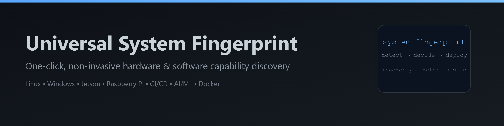
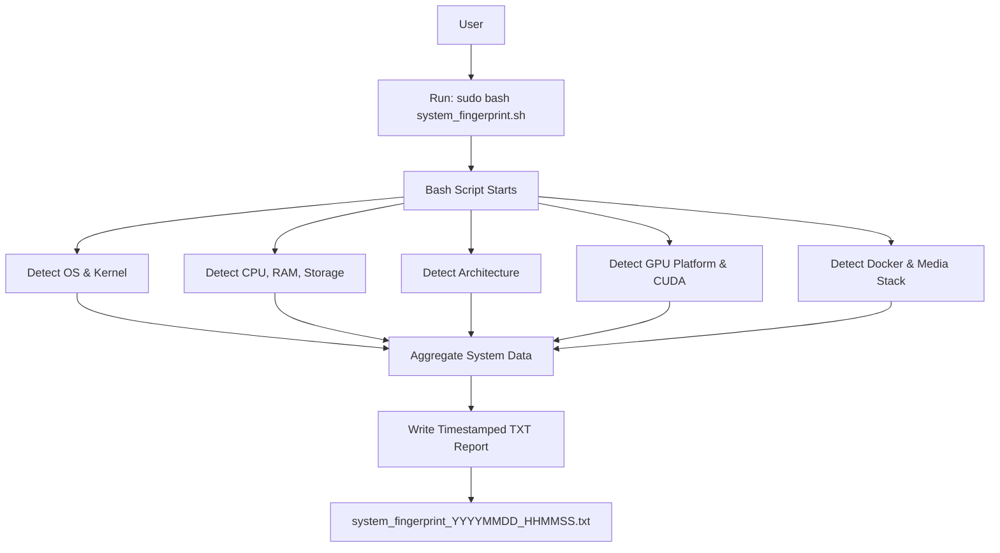
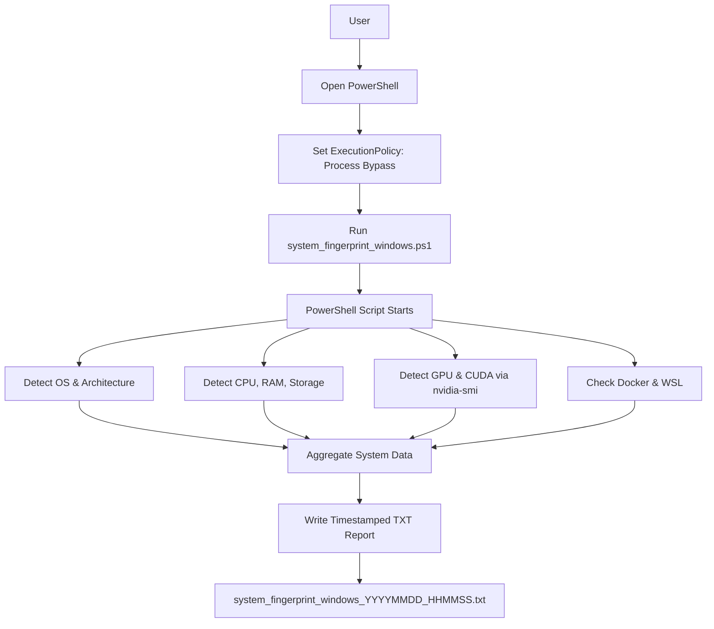

<p>
  
  
  
  
  
  
  
</p>


# Universal System Fingerprint - How to Run

The **Universal System Fingerprint** tool provides a **one-click, read-only system inspection** for Linux and Windows machines.

It collects **hardware and software capability data** in a **non-intrusive** manner and stores it in a timestamped text file.
The output is designed to act as a **pre-check and decision input** for:

* Workflow automation
* CI/CD pipelines
* AI/ML environment bootstrapping
* Multi-architecture Docker image builds
* Edge and fleet deployment planning

---

## Why This Exists

While working on CI/CD workflows across edge devices, Jetson boards, and x86/HPC machines, I kept running into the same problem: before doing anything useful, I had to manually figure out what the target system could actually do. Architecture, GPU availability, CUDA/TensorRT versions, Docker runtime support - all things that *should* be obvious, but usually weren’t.

There were already tools for this, but most were bloated, required installation, modified the system, or pulled in unnecessary dependencies just to answer simple questions. All I wanted was a **one-click, read-only, zero-overhead way** to get reliable system details upfront, so CI/CD pipelines and container builds could make the right decision before failing later. This utility came out of that need - a small, non-invasive system fingerprint that does exactly one job: tell your workflows what they’re really running on, quickly and safely.

---

## 1. Linux (Ubuntu, Debian, Jetson, Raspberry Pi, Servers)

### Requirements

* Bash shell
* `sudo` access

### Steps

1. Copy the script into a file:

```bash
nano system_fingerprint.sh
```

2. Paste the script content and save.

3. Make it executable:

```bash
chmod +x system_fingerprint.sh
```

4. Run the script:

```bash
sudo bash system_fingerprint.sh
```

### Output

A file will be created in the same directory:

```
system_fingerprint_YYYYMMDD_HHMMSS.txt
```

This file contains detailed information about:

* OS and kernel
* CPU, memory, and storage
* Architecture (x86_64 / arm64 / armv7)
* GPU platform (Jetson / NVIDIA x86 / none)
* CUDA and TensorRT availability
* Docker and NVIDIA container runtime
* Media stack (FFmpeg, GStreamer, V4L2)
* Python and OpenCV capabilities

### Linux Execution Flow



---

## 2. Windows (Native, No WSL Required)

### Requirements

* Windows 10 or Windows 11
* PowerShell (built-in)

### Steps

1. Copy the script into a file named:

```
system_fingerprint_windows.ps1
```

2. Open **PowerShell**:

   * Press **Win + X**
   * Select **Windows PowerShell**
   * Choose **Run as Administrator** (recommended)

3. Allow script execution for this session only:

```powershell
Set-ExecutionPolicy -Scope Process -ExecutionPolicy Bypass
```

4. Navigate to the script directory:

```powershell
cd path\to\script
```

5. Run the script:

```powershell
.\system_fingerprint_windows.ps1
```

### Output

A file will be created in the same directory:

```
system_fingerprint_windows_YYYYMMDD_HHMMSS.txt
```

This file contains detailed information about:

* Windows version and architecture
* CPU, memory, and storage
* GPU vendor and driver details
* NVIDIA CUDA availability (via `nvidia-smi`)
* Docker and WSL status
* Python availability

### Windows Execution Flow



---

## Why This Tool Matters for Workflow Automation and CI/CD

The Universal System Fingerprint acts as a **capability discovery and pre-check layer** before any installation, build, or deployment step is executed.

Instead of assuming hardware support, automation systems can **decide based on real system data**.

### Problems This Solves

* Running the same AI/ML workflow across:

  * x86 servers with NVIDIA GPUs
  * Jetson edge devices
  * Raspberry Pi control or gateway nodes
* Preventing failed builds caused by:

  * Incorrect CUDA versions
  * Unsupported architectures
  * Missing GPU runtimes
* Designing **one CI/CD pipeline** that adapts itself per machine

### Typical Automation Use Cases

**CI/CD Pre-Checks**

* Detect whether a runner supports GPU builds
* Decide whether to build:

  * CPU-only Docker images
  * CUDA-enabled images
  * TensorRT inference engines

**AI/ML Environment Bootstrapping**

* Select the correct inference backend:

  * TensorRT on Jetson
  * CUDA on x86
  * CPU fallback on Raspberry Pi
* Avoid installing incompatible frameworks

**Multi-Architecture Docker Builds**

* Automatically choose:

  * `linux/amd64` vs `linux/arm64`
  * Jetson L4T base images vs standard CUDA images
* Reduce wasted build time and failed jobs

**Edge and Fleet Management**

* Run daily as a non-invasive audit
* Detect system drift (OS, kernel, CUDA changes)
* Maintain a consistent hardware inventory across nodes

---

## Design Principles

* Read-only execution
* No system configuration changes
* No network access
* No installation or rollback
* Safe for daily and CI execution
* Human-readable and automation-friendly output

---

## Notes

* The scripts are **read-only** and make no system changes.
* No installation or rollback is required.
* The generated report can be shared directly to:

  * Auto-design bootstrap scripts
  * Select CPU vs GPU inference paths
  * Generate hardware-specific Dockerfiles
  * Speed up deployment planning across heterogeneous systems

---

## Final Note

This tool is intentionally **not** an installer or configurator.

It is a **decision-enabling pre-check**, designed to provide accurate system capability data so that higher-level automation (CI/CD, AI/ML bootstrapping, Docker builds, edge deployments) can run **safely, deterministically, and efficiently** across diverse hardware.

---


